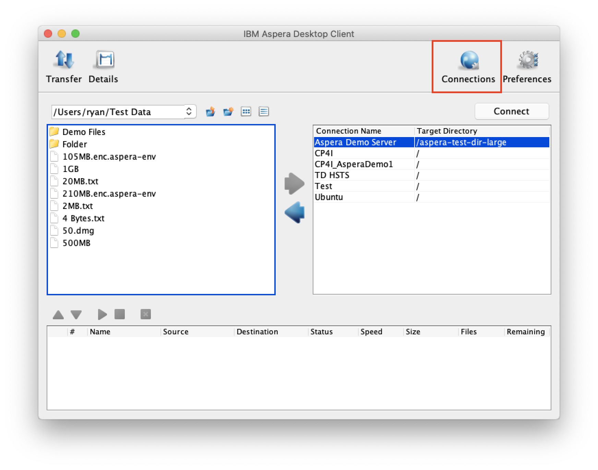
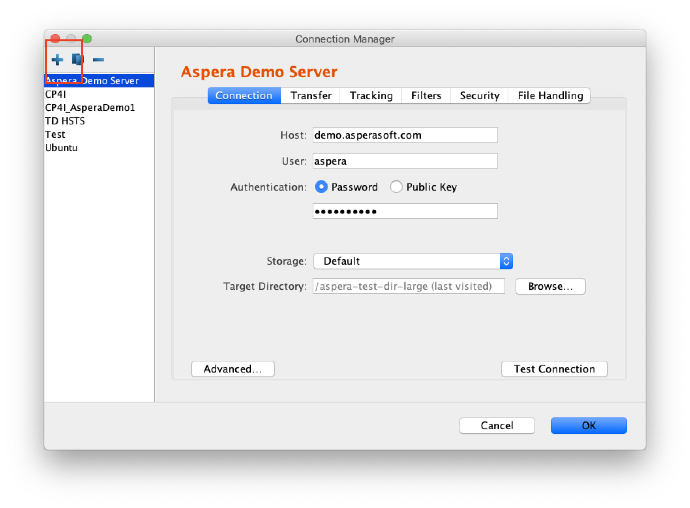
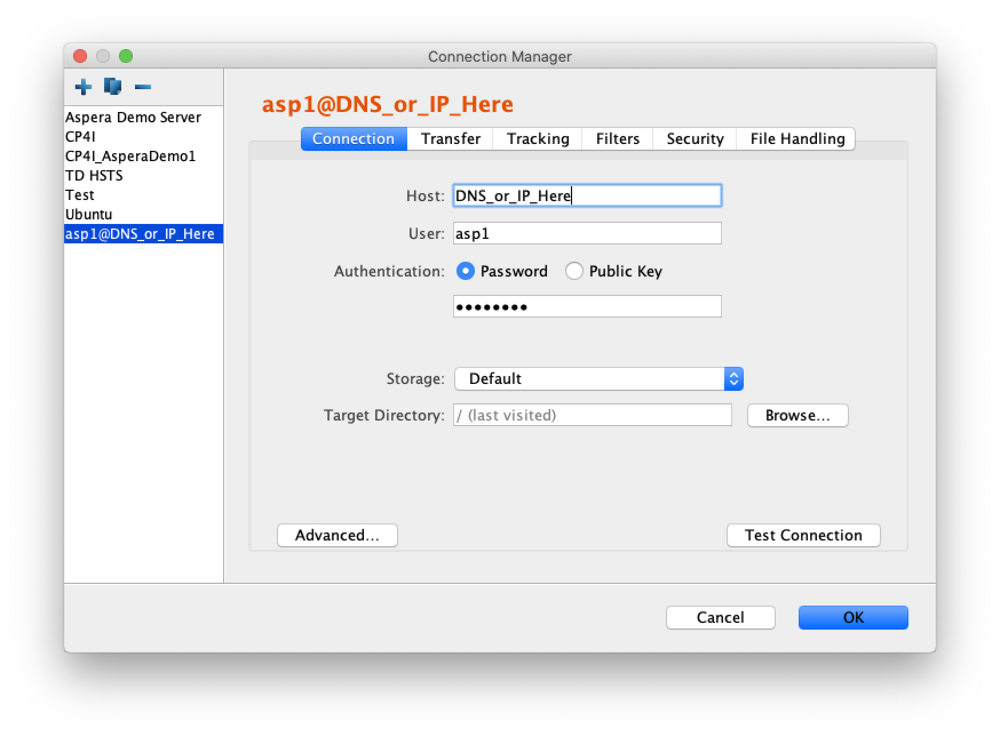
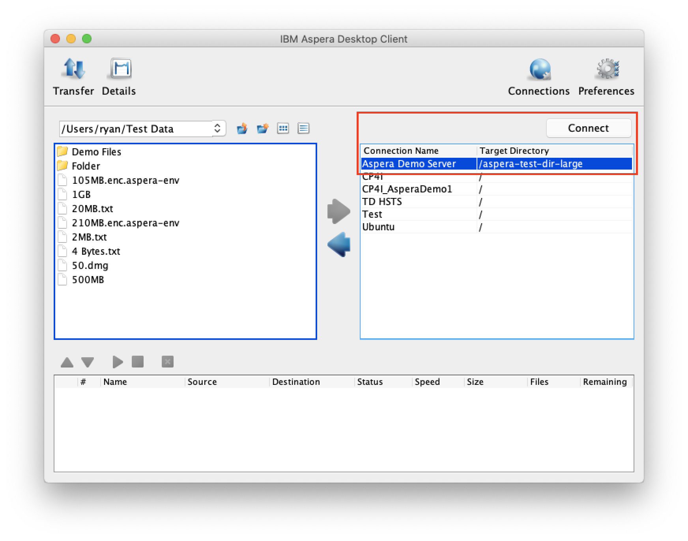

1. [Download](https://downloads.asperasoft.com/en/downloads/2) and install Aspera Client
   on your preferred OS of choice; Mac, Windows, Linux, by downloading and running through
   the installer with default settings.

   Note: Use the Aspera Icon to start the GUI on Mac and Windows. Run `asperascp` to start
   to GUI on Linux.

1. Start the Aspera Client and select `Connections`

   

1. Select `+` to add a new Connection Profile for the Server

   

1. Complete the new Connection Profile form to add the connection to the server.

   - **Host**: DNS or IP Address of the Server
   - **User**: asp1
   - **Password**: Use the password for asp1 user created when setting up the server
   - **Storage**: Leave as default as we have set up regular default storage on the server
     (/AsperaRootDir/asp1)
   - **Target Directory**: This is a path to go deeper into the root directory
     `/AsperaRootDir/asp1`

   

1. Click `Test Connection` and `OK` once connection is successful. If there are any issues
   please reach out to an IBM representative.

1. Select the Connection you just created and then click `Connect`

   

You can now drag and drop between filesystem panes in the GUI to upload and download
files. During a file transfer you can select the transfer from the bottom pane to adjust
realtime transfer rates and view session details.

export default ({children}) => 
{children}

