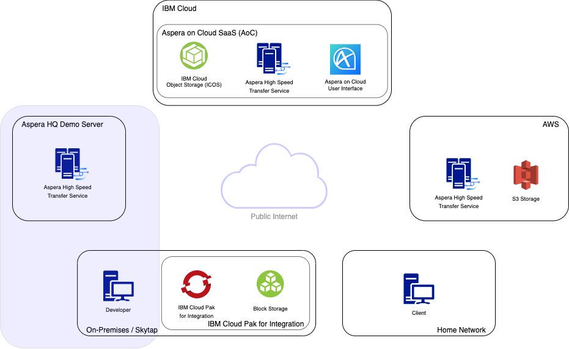
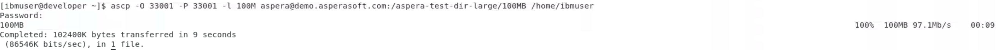
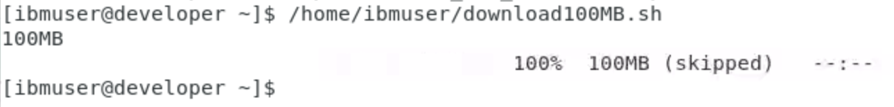

export const Title = () => High Speed File Transfer at the Speed of Business

<h2 style={{color: 'red'}}>DRAFT</h2>

## Aspera ascp CLI

Aspera began as a command line tool called `ascp`. In this first section we will start by
using the `ascp` CLI to download a file from the Aspera hosted Demo Server.

## Using the ascp CLI

1. Navigate back to your Terminal window and ensure you are in the `/home/ibmuser`
   directory by running `pwd`.

1. Execute the following command to download the file named '100MB' from the Aspera Demo
   Server:

   `ascp -O 33001 -P 33001 -l 100M aspera@demo.asperasoft.com:/aspera-test-dir-large/100MB /home/ibmuser`

   When prompted for the password enter: `demoaspera`

   Note: `-O` sets the UDP port, `-P` sets the SSH port & `-l` sets the Target Rate

   

The file named `100MB` has now been download to the `/home/ibmuser` directory. You can
`ls -lh` to see the new file.

## Scripting the ascp CLI

The `ascp` CLI is a flexible option for initiating FASP transfers. The CLI can easily be
used in new or existing scripts to replace tools like; scp, ftp, sftp, rsync and other
similar tcp based protocols to improve transfer performance and management capabilities.
Lets look at a quick example of how easy it is to use `ascp` in a script:

1. Export the password as an environment variable so the script can run without user
   interaction:

   `export ASPERA_SCP_PASS=demoaspera`.

   **Note:** This is not compulsory however if you do not export the password you will be
   prompted for the password each time the script is executed. You also have the option of
   configuring SSH Key based authentication.

1. Execute the `download100MB.sh` script in the `/home/ibmuser` directory by running:

   `/home/ibmuser/download100MB.sh`

   

   You will notice this time the file gets `skipped`. If you look at the command being run
   in the script (`cat /home/ibmuser/download100MB.sh`) there is an additional option
   added `-k 1` which tells ascp to only re-download/resume a file download if file
   attributes are different. You can read more about resume-level (-k) and other options
   with `man ascp`.

## Recap

You have just downloaded a file from the Aspera Demo Server using the Aspera `ascp` CLI
both directly and in a script.

These download commands are simple when you know what file is available for download. What
happens when users are not familiar with the structure of the remote filesystem? Next up
we will look at improving the end-user experience using the native Aspera Client GUI.
