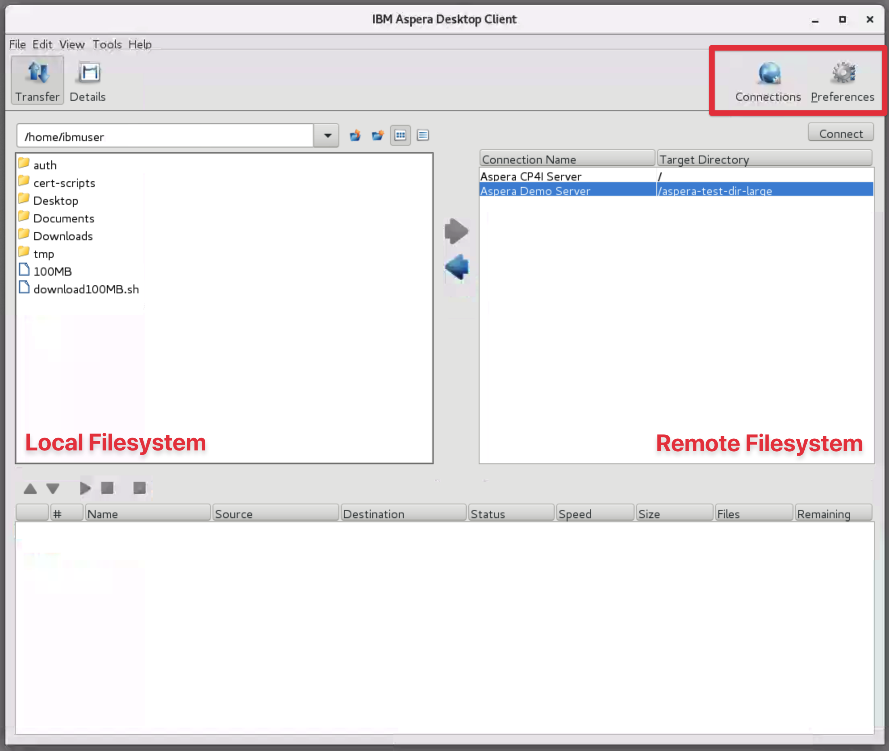
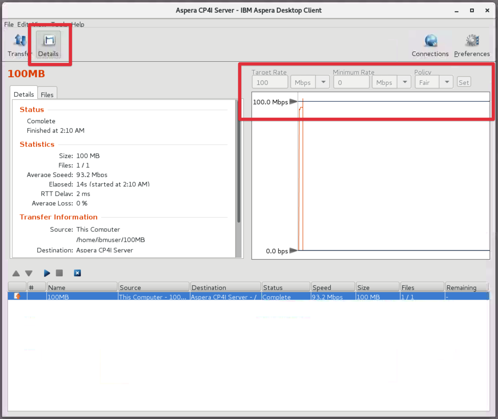
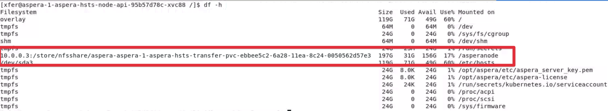
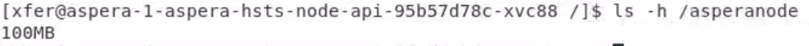

export const Title = () => High Speed File Transfer at the Speed of Business

<h2 style={{color: 'red'}}>DRAFT</h2>

## Connecting to CP4I with the Aspera Native Client

We will now use the Aspera Client GUI to upload a file to another Aspera Server. In this
section of the lab we will be connecting to an Aspera Cluster running in in IBM Cloud Pak
for Integration (CP4I). Aspera in CP4I is a cloud-native microservices based deployment of
Aspera built on-top of OpenShift and Kubernetes.

## Let's get started

1. Open a new Terminal window by double clicking the Terminal icon on the desktop.

1. Run the command `asperascp` to open the Linux Aspera Client GUI and minimise the
   Terminal window, you will not need to use this Terminal window again. You must leave
   the terminal window open for the life of the Client process.

   

   The Aspera Client GUI features the local filesystem on the left of the window and the
   remote filesystem on the right.

   The `Connections` button allows you to add new Server connections to the Remote
   Filesystem pane. There are currently two connections configured; the Aspera CP4I Server
   and the Aspera Demo Server.

   The `Preferences` button displays client side preferences. If you click this you will
   see that the current 'Default Target Rate' is set to 100Mbps, the client will not
   exceed this rate.

> At this point you can understand how the GUI makes downloading from remote filesystems
> easier... When connected you can easily browse the content on the remote server.

## Upload a file to the Aspera Cluster running in CP4I

1. Navigate the local filesystem (left pane) to `/home/ibmuser/`

1. Select 'Aspera CP4I Server' from the remote filesystem (right pane) and select
   'Connect'.

   The client will make a connection to the Aspera Cluster in CP4I and you will now be
   able to browse the clusters underlying NFS filesystem, it is empty to begin with.

1. Perform an upload by simply dragging and dropping the file `100MB` from the left pane
   to the right.

   Note: You can select the active session from the bottom panel and then click on
   `Details` in the upper left corner of the window to see the status for the transfer and
   optionally adjust transfer rates.

   

## Optional: Confirm the file is now in the clusters NFS attached storage

You have now successfully uploaded the file to an NFS persistent volume configured in the
Kubernetes cluster. You can confirm this by accessing the container and viewing the
deployments mounted storage.

1. Navigate back to your first Terminal window.

1. Execute a bash prompt in the Aspera Node API pod:

   `oc -it exec aspera-1-aspera-hsts-node-api-56d574bf77-sk5ns -c asperanode -- bash`

1. View the NFS mount mounted on `/asperanode` to the cluster by running `df -h`

   

1. List the contents of the mount to confirm the file is now available inside of
   Kubernetes:

   `ls -h /asperanode`

   

1. Execute `exit` from the terminal to exit the bash prompt.

## Recap

You have now moved the file that you downloaded from the Aspera Demo server into a
Kubernetes environment. Other pods can now access this data.

In a later section you will be using the Aspera API to trigger a transfer that moves this
file from the Kubernetes cluster to IBM Cloud Object Storage. To do this you require a
special token that allows you access to this storage. Fortunately the token has already
been generated for you and is currently sitting in a bucket in AWS S3 in Toronto. In the
next section we will use the browser and Aspera Connect Client to download this key from
S3 bucket in Toronto.
