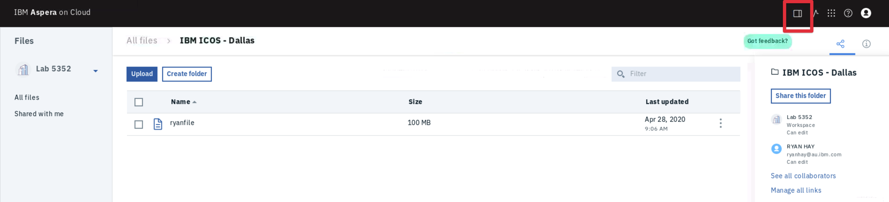
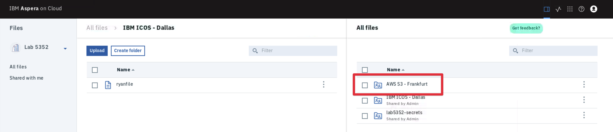
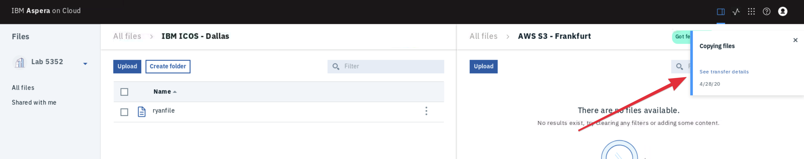
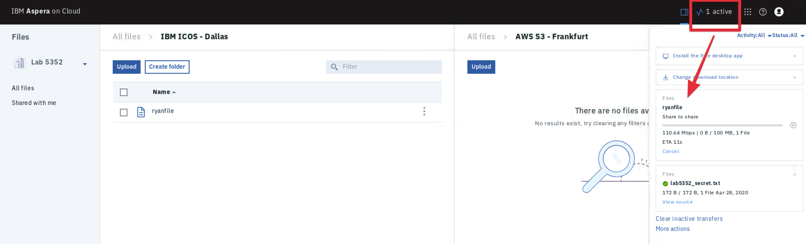

export const Title = () => High Speed File Transfer at the Speed of Business

<h2 style={{color: 'red'}}>DRAFT</h2>

## Move Content between Two Different Cloud Providers

You now have your data in the cloud. As you know most of the time we are dealing with
multiple cloud providers, we need to make it easy to move data between them. In this
section you will move your file from IBM Cloud Object Storage in Dallas to AWS S3 Storage
in Frankfurt.

## Lets Go

1. Navigate to the `IBM ICOS - Dallas` folder so you can see the file you just sent to the
   cloud.

1. Select the `split view` button in the toolbar at the top-right of the page to open
   another pane to the right of your existing view.

   

1. Select the `AWS S3 - Frankfurt` directory

   

1. Drag and drop your file from the IBM ICOS Dallas storage in the left pane to the AWS S3
   Frankfurt storage in the right pane to initiate a cloud-to-cloud transfer. Once you
   drop your file into the right pane you will be notified that a copy has begun.

   Note: You can hold `alt` when dropping to perform a `move` rather than a `copy`.

   

1. View the status of the transfer by selecting the `Transfer Monitor` button from the
   toolbar.

   

## Recap

You have now successfully copied your file between clouds from IBM ICOS in Dallas to AWS
S3 in Frankfurt. Its important to note that Aspera does not modify or store these files in
any proprietary way. Other services or processes running in the cloud can easily access
the contents of these buckets.

You have one more section to go. Let's take a look at how you might distribute large
amounts of data to end-users.
