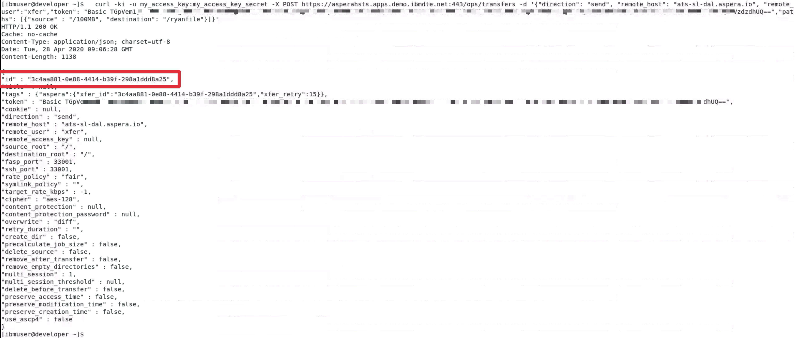
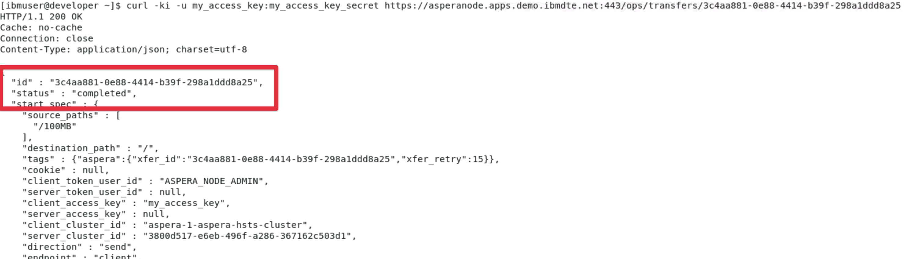
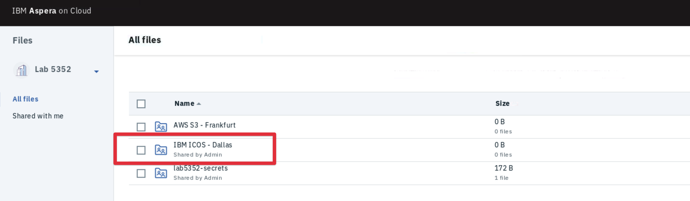

export const Title = () => <span>High Speed File Transfer at the Speed of Business</span>

<h2 style={{color: 'red'}}>DRAFT</h2>

## Starting a Node-to-Node Transfer with the Aspera Node API

You are now familiar with the Aspera CLI, Native Client and the Aspera Browser Client. If
you find you would like to take advantage of the transfer speeds provided by the FASP
protocol but don't want to be handling transfers manually you can use the Aspera API to
programmatically trigger transfers between nodes.

In this section of the lab you will move the file `100MB` from the NFS storage attached to
the Kubernetes cluster to IBM Cloud Object Storage (ICOS) located in IBM Cloud Dallas
using the 'Aspera Node API'.

## Lets Begin

1. Navigate back to the Terminal on the Developer machine.

1. Move to your Home directory if you are not already there: `cd ~`

1. Print the contents of the secret that was downloaded in the previous section:

   `cat lab5352_secret.txt`

   This is the transfer token that will be used to authenticate the API request.

1. Execute the API call making sure you substitute the two placeholders.

   This API call will initiate an Aspera transfer between the source node, the CP4I
   OpenShift cluster and the remote node, an Aspera Transfer Server running as a service
   in IBM Cloud Dallas connected to IBM Cloud Object Storage.

   Replace the following placeholders:

   - TOKEN_GOES_HERE: Should be replaced with the token printed in the previous step.
     Ensure you keep the space after the word 'Basic', the token ends with two equal signs
     '=='.
   - YOUR_FILENAME_HERE: Create a unique filename for your file. All lab attendees will be
     sending their file to the same IBM ICOS bucket so this way you can ensure your file
     has been sent.

   ```bash
   curl -ki -u my_access_key:my_access_key_secret -X POST https://asperahsts.apps.demo.ibmdte.net:443/ops/transfers -d '{"direction": "send", "remote_host": "ats-sl-dal.aspera.io", "remote_user":"xfer","token": "Basic TOKEN_GOES_HERE","paths": [{"source" : "/100MB", "destination": "/YOUR_FILENAME_HERE"}]}'
   ```

   Once you make the POST an Aspera 'Transfer Spec' will be returned. There is a lot of
   information here but we only need the ID for now.

1. Make note of the ID returned in the `Transfer Spec`

   

1. Check the status of the file transfer by querying the `/ops/transfers/:id` endpoint
   substituting your ID returned in the Transfer Spec:

   `curl -ki -u my_access_key:my_access_key_secret https://asperanode.apps.demo.ibmdte.net:443/ops/transfers/TRANSFER_ID_HERE`

   If successful the status will `completed`

   

1. Navigate back to Aspera on Cloud in Firefox and select `All Files` from the breadcrumb
   to get back to your home view.

   

1. Select the `IBM ICOS - Dallas` folder to browse the Dallas based Object Storage you
   just sent to.

   

   You will now be able to see the file named with your own name. Note: Due to caching you
   may have to wait a few minutes before your file appears in this view.

## Recap

You have successfully initiated a remote transfer via API between a CP4I Kubernetes
Cluster and an Aspera Transfer Server running in IBM Cloud connected to IBM Cloud Object
Storage located in Dallas.

Next up you will see how simple it is to now move your file from IBM Cloud Object Storage
in Dallas to AWS S3 in Frankfurt.
