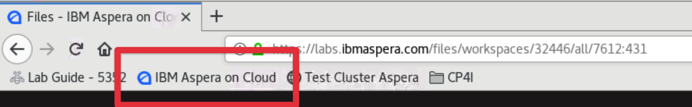

Before you begin working in these environment there are some prerequisite tasks that must
be completed. Please complete the following prerequisite tasks before moving on with the
lab.

### 1. Load the working environment

In the SkyTap environment select the 'Developer' machine and login as the user `ibmuser`
with the password `engageibm`.

### 2. Open the lab guide

To make copying snippets easier it is recommended to have the lab guide open by selecting
the `Lab Guide - 5352` bookmark in Firefox.

### 3. Confirm the Aspera Transfer Cluster in CP4I is running

1.  Select the `Test Cluster Aspera` bookmark in Firefox. This bookmark queries the
    `/info` api.

    

1.  Accept the security warning

    

1.  Use the saved access key and access key secret credentials. A JSON output indicates
    the Aspera Transfer Cluster is up and running.

    

### 4. Log in to OpenShift CLI

1.  Select the `Dashboards - Red Hat OpenShift Container Platform` bookmark in Firefox.

    

1.  Select Log in with `htpasswd` and use the `admin` credentials already saved in the
    browser.

    

1.  Select `admin` dropdown from the top-right corner and then the `Copy Login Command`
    button

    

    **Note:** You may be asked to log in again. Use `htpasswd` and the `admin` account
    again.

1.  Select the `Display Token` hyperlink to revel the API Token information

1.  Copy the content from the Log in with this token codebox

    

1.  Minimise Firefox so you can see the Desktop and double click the Terminal app to open.
1.  Paste the `oc login` command to log into the OpenShift cluster on the CLI.

    

### 5. Log in to Aspera on Cloud

1.  Maximise Firefox again and select the `IBM Aspera on Cloud` bookmark.

    

1.  Login with your unique IBM ID provided in the event tool, e.g.
    `thinklabs2020+XX@gmail.com`

1.  Select `Files` as your default app if you are prompted.

    

1.  Select the Workspace `lab 5352` from the Workspace switcher on the left of the screen
    by selecting the default workspace `Aspera Labs`. You will stay in this workspace for
    this lab.

    

You are now ready to begin the lab

export default ({children}) => 
{children}

