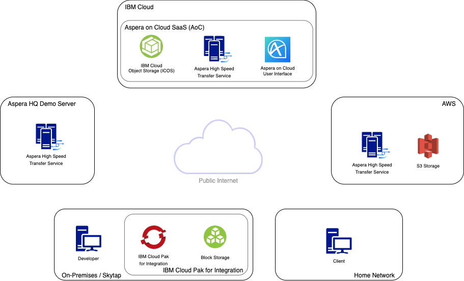

import Preparing from './prerequisite-preparing.mdx'
import Troubleshooting from './prerequisite-troubleshooting.mdx'
export const Title = () => High Speed File Transfer at the Speed of Business

<h2 style={{color: 'red'}}>DRAFT</h2>

## Lab Overview

The objective of this lab is to help you understand the various ways in which Aspera can
help you move your data in a hybrid environment. Throughout this lab we will use a single
file and move it between cloud, on-premises and home network environments. Each movement
of the file will use a different method of initiating a transfer so you can become
familiar with what options you have available to you.

Below is an overview of the environment we will be using for this Lab.

You don't have to understand where and how all of these components work together to create
a hybrid cloud file transfer solution just yet, that's the purpose of this Lab. A brief
description:

- On-Premises Developer machine: This is where we will be doing most of our work, we will
  use it for:
  - The native Aspera Client installed
  - Access to the
    [Cloud Pak for Integration](https://www.ibm.com/cloud/cloud-pak-for-integration)
    OpenShift cluster
  - Connecting to the Aspera on Cloud SaaS
  - Any other tasks...
- IBM Cloud, Aspera on Cloud: A SaaS implementation of Aspera that offers a unique User
  Interface, access to the Aspera High Speed Transfer Service in all major cloud and IBM
  Cloud Object Storage.
- AWS: We will use the Aspera High Speed Transfer Service to connect directly to S3
  storage in AWS.
- Demo Server: An Aspera Demo Server that can be used to test/trial FASP transfers with
  clients. This demo server comes configured by default as a connection when installing
  the Aspera Client.
- Client?

By the end of this Lab you will understand the multitude of options you have available to
you to move content easily between these components.

**Note:** Please keep in mind that for most if not all of these file movements there are
multiple ways in which each transfer could be done. At the end of the day FASP is a
transport layer technology and everything built on-top offers different ways of invoking
that protocol.

This lab will be broken into steps that follow a journey of a file originating in the
Aspera Demo Server through the Aspera Client, The CP4I Cluster, AoC ICOS storage, AWS S3
and then delivered to an end client.

Please complete the following prerequisite tasks in 'Preparing the lab environment' before
moving on with the lab.

<Accordion>
  <AccordionItem title="Preparing the lab environment">
    <Preparing />
  </AccordionItem>
  <AccordionItem title="Troubleshooting">
    <Troubleshooting />
  </AccordionItem>
</Accordion>
